# <a name="create-an-aspnet-core-web-app-in-azure"></a>Créer et déployer une application web ASP.NET Core dans Azure Web Apps


[Azure App Service](https://docs.microsoft.com/fr-ca/azure/app-service/) vous permet de créer et d’héberger des applications web, des back-ends mobiles et des API RESTful 
dans le langage de programmation de votre choix sans gérer l’infrastructure. Il offre une mise à l’échelle automatique et une haute disponibilité, 
prend en charge à la fois Windows et Linux et permet des déploiements automatisés à partir de GitHub, Azure DevOps ou n’importe quel référentiel Git.

## <a name="goal"></a> Objectif

Pour cette première partie du laboratoire, les participants vont créer une application Web ASP.NET Core dans Visual Studio. Ils vont ajouter un formulaire pour collecter les commentaires
des utilisateurs. L'application sera ensuite déployée sur Azure App Service.

## <a name="prerequisites"></a>Prérequis

Pour effectuer ce laboratoire, vous devez installer <a href="https://www.visualstudio.com/downloads/" target="_blank">Visual Studio 2019</a> avec la charge de travail **Développement web et ASP.NET**.

Si vous avez déjà installé Visual Studio 2019 :

- Installez les dernières mises à jour dans Visual Studio en sélectionnant **Aide** > **Rechercher les mises à jour**.
- Ajoutez la charge de travail en sélectionnant **Outils** > **Obtenir des outils et des fonctionnalités**.

## Cloner le dépôt

Pour commencer, vous devez cloner le dépôt Git du lab. 

Pour cela, créez un dossier LabCEM sur votre poste. Ouvrez l'invite de commande à partir de ce repertoire. Vous pouvez le faire en saisissant simplement **cmd** dans la zone de saisie du chemin du repertoire.

 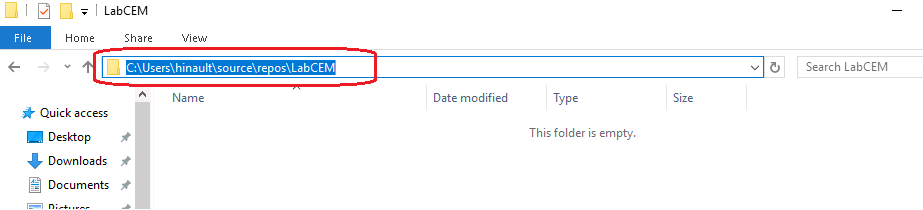
 
 Exécutez ensuite la commande suivante :

```
git clone https://github.com/hinault/workshop-azure-aspnet-core-devops.git
```
 
## <a name="open-website"></a> Ouvrir le projet de démarrage

Créez une application web ASP.NET Core en effectuant les étapes suivantes :

1. Ouvrez Visual Studio, puis sélectionnez **Ouvrir un projet ou une solution**.

 

2. Ouvrez la solution de l'étape 1 (\Etape 1 - Deployer une Web App sur Azure\Workshop\Workshop.sln).

3. Dans le menu Visual Studio, sélectionnez **Déboguer** > **Démarrer le débogage** pour exécuter l’application web localement.

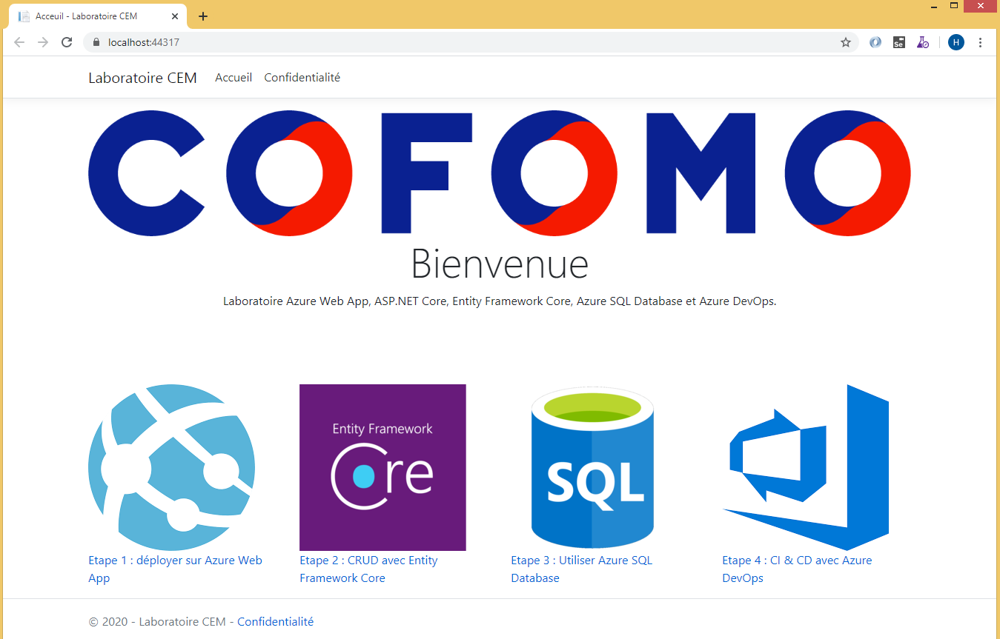

## <a name="publish-y"></a>Modifier l'application Web


### Le modèle

Dans le dossier **Models**, ajoutez une nouvelle classe **Commentaire.cs**, avec le code suivant :

```cs
using System;


namespace WebApp.Models
{
    public class Commentaire
    {
        public int Id { get; set; }

        public string Nom { get; set; }

        public string Email { get; set; }
        
        public string Texte { get; set; }
        
        public DateTime DateCommentaire { get; set; }
    }
}

```
### Le contrôleur

1. Faites un clic droit sur le dossier Controllers. Sélectionnez **Ajouter -> Contrôleur**.

2. Dans la fenêtre qui va s'afficher, sélectionnez **Contrôleur MVC - Vide**.

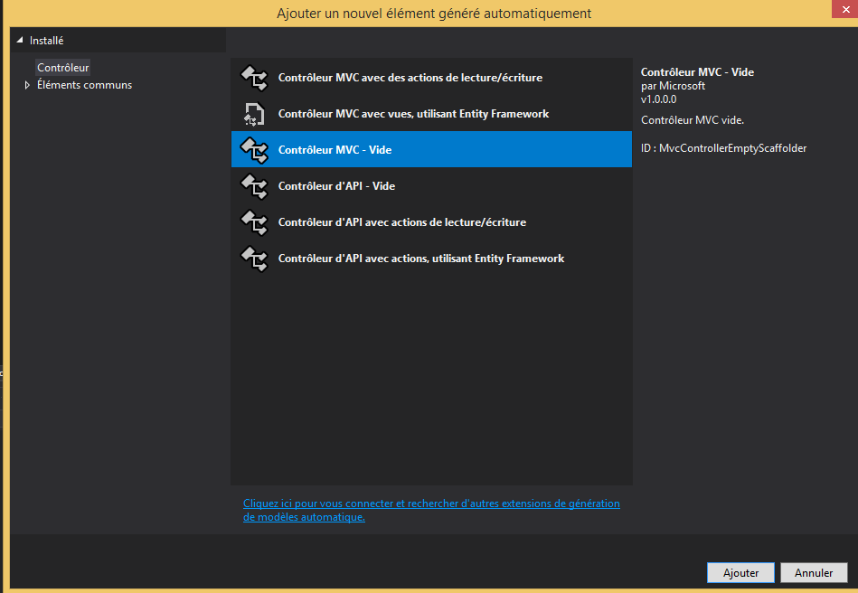

3. Dans la fenêtre suivante, donnez le nom **CommentairesController**.

4. Remplacez le code dans ce fichier par ce qui suit :

```cs
using System;
using System.Collections.Generic;
using Microsoft.AspNetCore.Mvc;
using WebApp.Models;

namespace WebApp.Controllers
{
    public class CommentairesController : Controller
    {
        public IActionResult Index()
        {
            var commentaires = new List<Commentaire>()
            {
                new Commentaire(){Id=1,Nom="Thomas", Email="thomas@test.com", Texte="Belle initiative", DateCommentaire=DateTime.Now},
                new Commentaire(){Id=1,Nom="Daniel", Email="daniel@test.com", Texte="Intéressant pour découvrir Azure", DateCommentaire=DateTime.Now}
            };

            return View(commentaires);
        }
    }
}
```

### La vue

1. Faites un clic droit sur le nom de la méthode **Index()** du contrôleur **CommentairesController**. 

1. Sélectionner Ajouter une Vue 

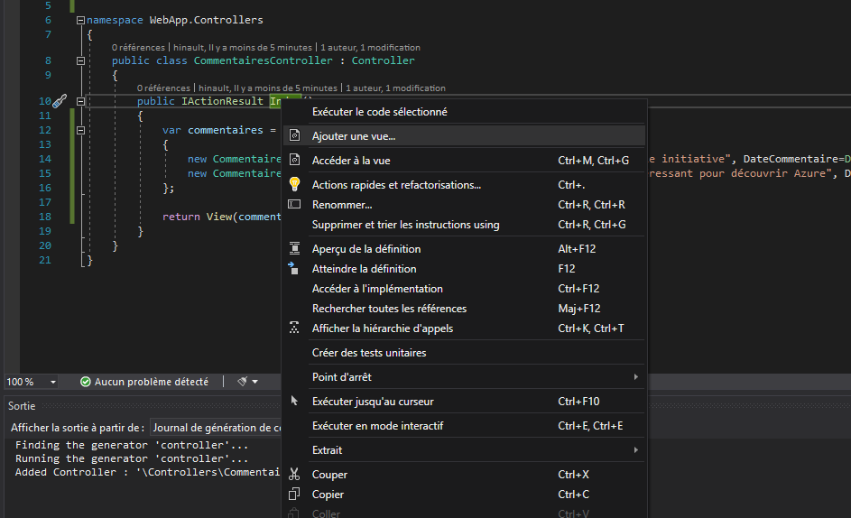

La fenêtre d'ajout de la vue va s'afficher.

Dans le champ Modèle, déroulez et sélectionnez 'List'.

Dans le champ Classe de  modèle, déroulez et sélectionnez 'Commentaire'.

Cliquez sur ajouter.

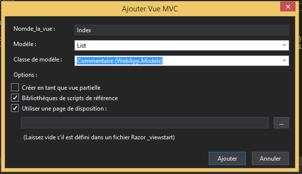

Un fichier Index.cshtml sera ajouté dans le dossier 'Views/Commentaires'.

### Le layout

Ouvrez le fichier /Views/Shared/_Layout.cshtml.

Après les lignes de code :

```cs
<li class="nav-item">
                            <a class="nav-link text-dark" asp-area="" asp-controller="Home" asp-action="Index">Accueil</a>
                        </li>
```

Ajoutez le code suivant 

```cs
<li class="nav-item">
                            <a class="nav-link text-dark" asp-area="" asp-controller="Commentaires" asp-action="Index">Commentaires</a>
                        </li>
```

### Exécuter l'application

Appuyez F5 pour exécuter l'application.

## <a name="publish-your-web-app"></a>Déployer sur Azure

Le moyen le plus simple de déployer votre application est d'utiliser la fonction Web Deploy de Visual Studio.

1. Dans l’**Explorateur de solutions**, cliquez avec le bouton droit sur le projet **WebApp**, puis sélectionnez **Publier**.

2. Choisissez **App Service**, puis cliquez sur **Créer un profil**.

   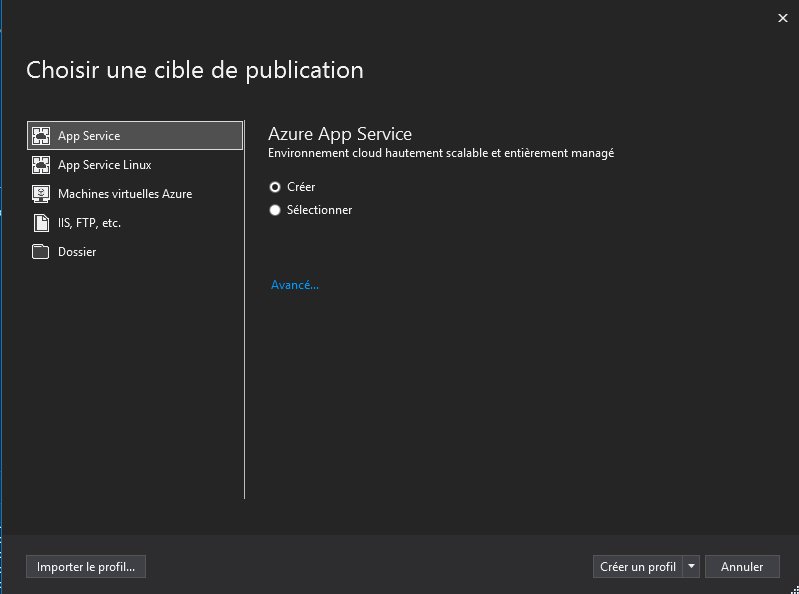

Dans **Créer un App Service**, vos options varient si vous êtes déjà connecté à Azure et si vous avez un compte Visual Studio lié à un compte Azure. 
 
3. Sélectionnez **Ajouter un compte** ou **Connexion** pour vous connecter à votre abonnement Azure. Si vous êtes déjà connecté, sélectionnez le compte souhaité.

   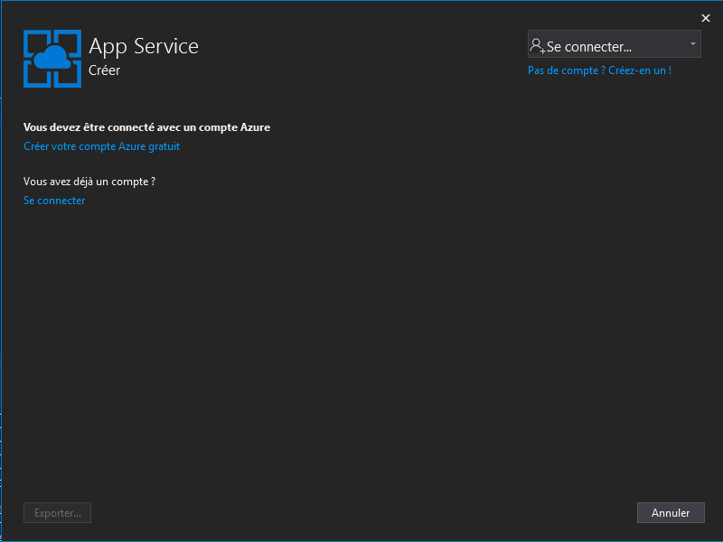

<a herf="https://docs.microsoft.com/fr-ca/azure/azure-resource-manager/management/overview#terminology">Un groupe de ressources</a> est un conteneur logique dans lequel les ressources Azure comme les applications web, les bases de données et les comptes de stockage sont déployés et gérés. Par exemple, vous pouvez choisir de supprimer le groupe de ressources complet ultérieurement en une seule étape.

4. Sélectionnez l'abonnement et le groupe de ressources qui vous ont été attribués.

<a href="https://docs.microsoft.com/fr-ca/azure/app-service/overview-hosting-plans">Un plan App Service</a> spécifie l’emplacement, la taille et les fonctionnalités de la batterie de serveurs web qui héberge votre application

5. Pour le **Plan d’hébergement**, sélectionnez **Nouveau**.

6. Dans la boîte de dialogue **Configurer le plan d’hébergement**, entrez les valeurs du tableau suivant, puis sélectionnez **OK**.

   | Paramètre | Valeur suggérée | Description |
   |-|-|-|
   |Plan App Service| MonPremierWebAppPlan | Nom du plan App Service. |
   | Location | Canada Centre | Centre de données dans lequel l’application web est hébergée. |
   | Size | Gratuit | Le [niveau tarifaire](https://azure.microsoft.com/pricing/details/app-service/?ref=microsoft.com&utm_source=microsoft.com&utm_medium=docs&utm_campaign=visualstudio) détermine les fonctionnalités d’hébergement. |

   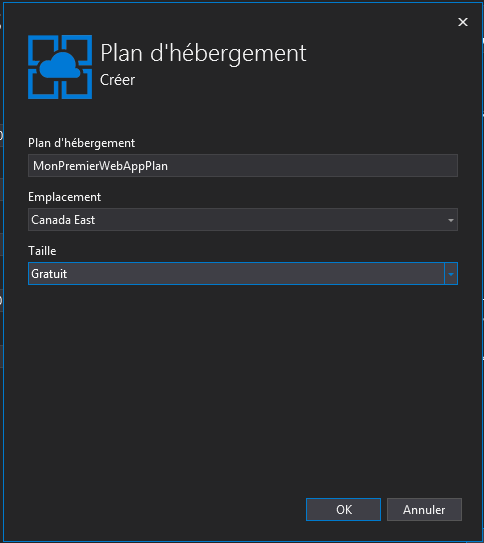

8. Dans **Nom**, entrez un nom d’application unique qui inclut uniquement les caractères valides `a-z`, `A-Z`, `0-9` et `-`. Vous pouvez accepter le nom unique généré automatiquement. L’URL de l’application web est `http://<app_name>.azurewebsites.net`, où `<app_name>` est le nom de votre application.

   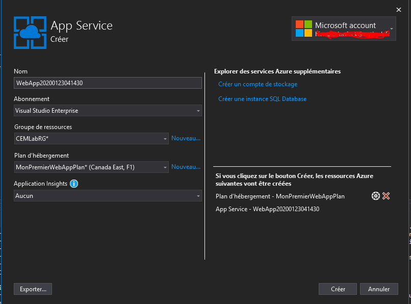

9. Sélectionnez **Créer** pour commencer à créer les ressources Azure.

Une fois les ressources Azure créées, une page récapitulative va s'afficher.

 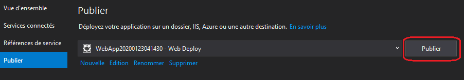

10. Dans la page récapitulative intitulée **Publier**, sélectionnez **Publier**.

Une fois la publication terminée, Visual Studio lance le navigateur avec votre application en cours d'exécution.

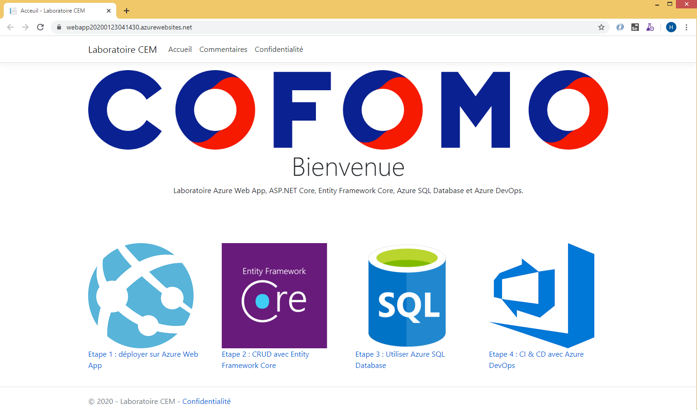

Le nom d’application spécifié dans la page **Créer un App Service** est utilisé en tant que préfixe d’URL au format `http://<app_name>.azurewebsites.net`.


**Félicitations !** Votre application web ASP.NET Core s’exécute en temps réel dans Azure App Service.

## <a name="manage-the-azure-app"></a>Gérer l’application Azure

Pour gérer l’application web, accédez au [Portail Azure](https://portal.azure.com), puis cliquez sur **Groupes de ressources**

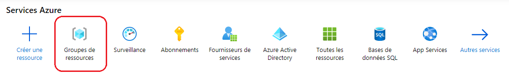

Dans la page **Groupes de ressources**, sélectionnez votre groupe de ressources.

Vous aurez deux ressources dans ce groupe, soit : le **Plan App Service** et **l'App Service**. 

Sélectionnez **L'App Service**.


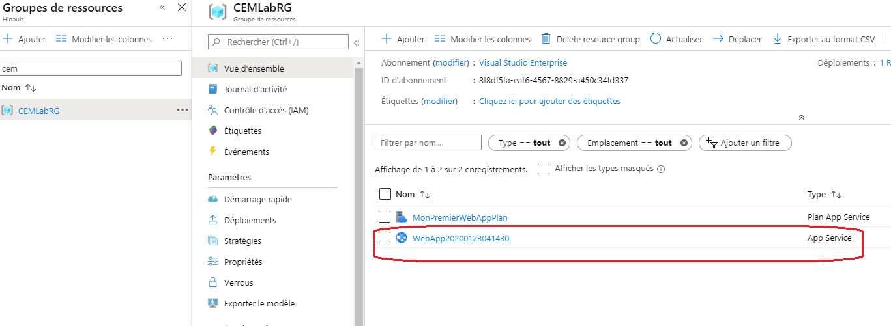


Vous verrez la page Vue d’ensemble de votre application web. Ici, vous pouvez effectuer des tâches de gestion de base, par exemple parcourir, arrêter, démarrer, redémarrer et supprimer.

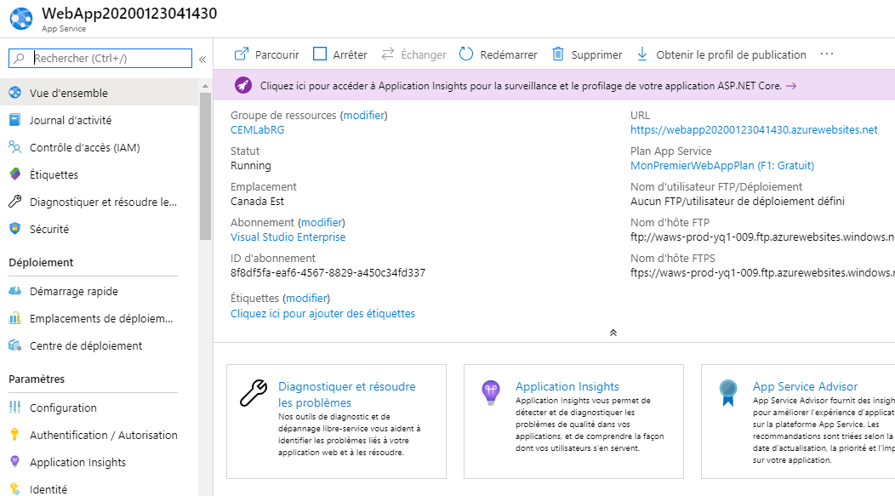

Le menu de gauche fournit différentes pages vous permettant de configurer votre application.

## FIN
