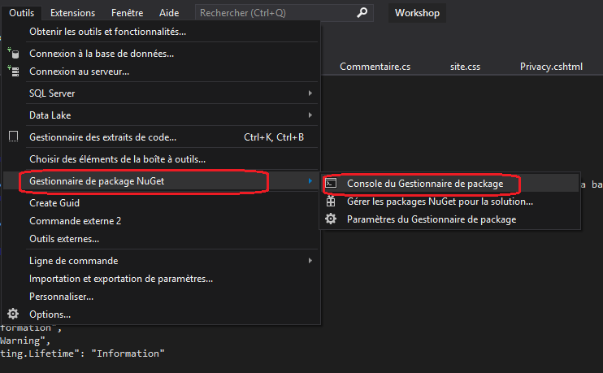
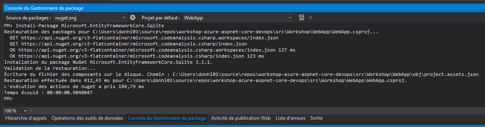
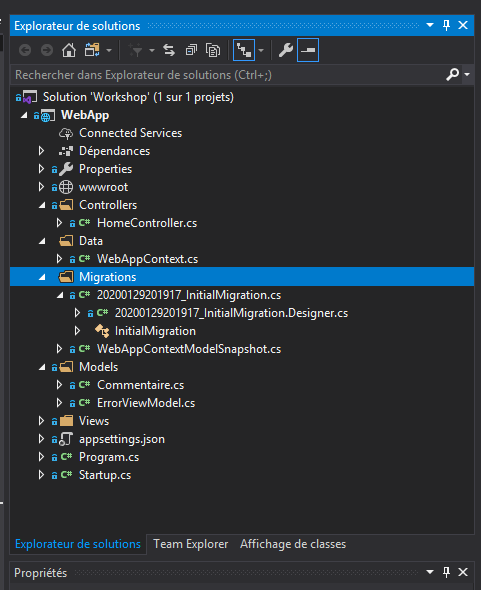
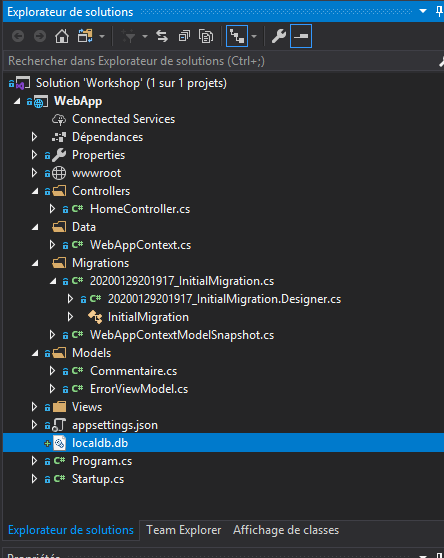
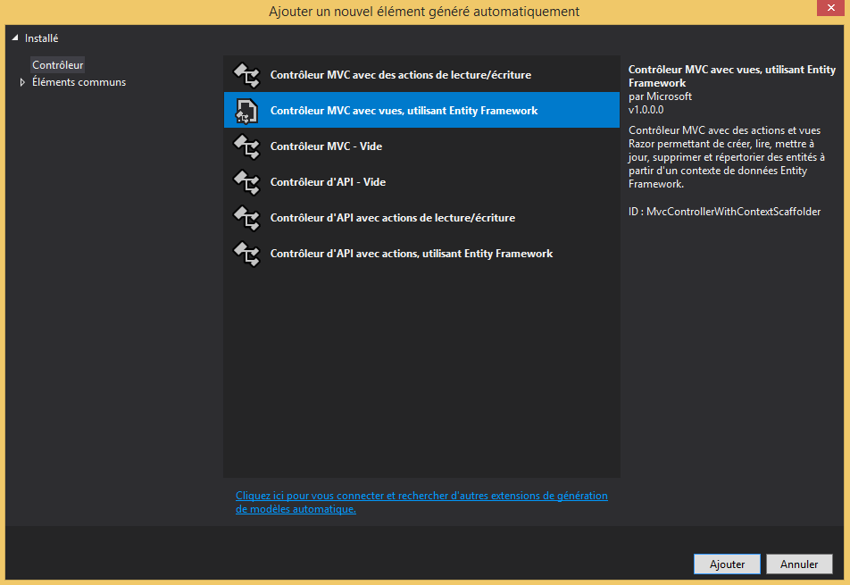
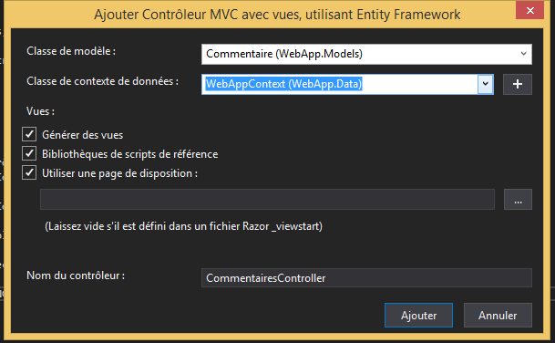
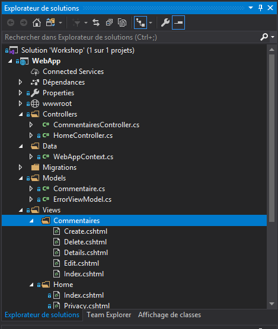

# <a name="crud-avec-ef-core">CRUD avec Entity Framework Core</a>

<a href="https://docs.microsoft.com/fr-ca/ef/core/">Entity Framework (EF) Core</a> est une version légère, extensible, open source et multiplateforme de la très connue technologie d’accès aux données Entity Framework.
EF Core peut servir de mappeur relationnel/objet (O/RM), permettant aux développeurs .NET de travailler avec une base de données à l’aide d’objets .NET, et éliminant la nécessité de la plupart du code d’accès aux données qu’ils doivent généralement écrire. EF Core prend en charge de nombreux moteurs de base de données.

## <a name="objectif"></a> Objectif

Pour cette deuxième partie du laboratoire, les participants vont modifier leur application pour intégrer la prise en charge de Entity Framework. Ils utiliseront ensuite 
les outils de Visual Studio pour mettre en place des formulaires permettant la consultation, l'ajout, la modification et la suppression des données dans une banque SQLite
en utilisant Entity Framework Core.

## <a name="open-web-site">Ouvrir le projet de démarrage</a>

1. Ouvrez Visual Studio, puis sélectionnez **Ouvrir un projet ou une solution**.

 

2. Ouvrez la solution de l'étape 2 (\Etape 2 - Ajouter Entity Framewor Core\Workshop\Workshop.sln).

3. Supprimer le fichier **CommentairesController.cs** dans le dossier **Controllers**.

4. Supprimer le dossier **Commentaires** dans le dossier **Views**

## <a name="validation"></a> Validation avec les DataAnnotations

Les DataAnnotations sont utilisés pour personnaliser le modèle de données en utilisant des attributs qui spécifient des règles de mise en forme, de validation et de mappage de base de données.

Remplacez le contenu du fichier **Models\Commentaire.cs** par le code qui suit : 

```cs
using System;
using System.ComponentModel.DataAnnotations;

namespace WebApp.Models
{
    public class Commentaire
    {
        public int Id { get; set; }

        public string Nom { get; set; }

        [Required]
		[DataType(DataType.EmailAddress)]
        [Display(Name = "Adresse Mail")]
        public string Email { get; set; }

        [Required]
        [Display(Name = "Commemtaire")]
        public string Texte { get; set; }

        [Required]
        [Display(Name = "Date")]
        [DataType(DataType.Date)]
        [DisplayFormat(DataFormatString = "{0:yyyy-MM-dd}", ApplyFormatInEditMode = true)]
        public DateTime DateCommentaire { get; set; }
    }
}


```

L'attribut **Required** rend le champ obligatoire. 

L'attribut **Display** permet de définir le nom d'affichage.

L'attribut **DataType** permet de spécifier un type de données qui est plus spécifique que le type intrinsèque de la base de données.

L'attribut **DisplayFormat** permet de spécifier explicitement le format de la date.


## <a name="">Le DBContext</a>

Le **Database Context (DBContext)** est un élément important d'Entity Framework Core. C'est le pont entre votre domaine (ou vos classes d'entité) et la base de données.

1. Vous allez créer un nouveau dossier **Data**.

2. Dans ce dossier, vous allez ajouter un nouveau fichier WebAppContext.cs.

3. Remplacez le code dans ce fichier par ce qui suit :

```cs
using Microsoft.EntityFrameworkCore;
using WebApp.Models;

namespace WebApp.Data
{
    public class WebAppContext : DbContext
    {

        public WebAppContext(DbContextOptions<WebAppContext> options)
                    : base(options)
        {
        }

        public DbSet<Commentaire> Commentaires { get; set; }

    }
}
```


## <a name="connectionstring">La chaine de connexion</a>

La chaine de connexion (ConnectionString) fournit les informations pour se connecter à la base de données, dont le nom de la base de données, le nom d'utilisateur, 
le mot de passe ou encore le serveur de base de données.

Dans notre cas, nous allons dans un premier temps utiliser une base de données locale SQLite. 

Editez le fichier appsettings.json, et ajoutez la chaine de la connexion :

```json
{
  "Logging": {
    "LogLevel": {
      "Default": "Information",
      "Microsoft": "Warning",
      "Microsoft.Hosting.Lifetime": "Information"
    }
  },
  "ConnectionStrings": {
    "LocalConnection": "Data Source=localdb.db"
  },
  "AllowedHosts": "*"
}
```

## <a name="install-efcore-sqlite">Installer le package Entity Framework Core pour SQLite</a>

A ce stade, nous allons utiliser la console du gestionnaire de package NuGet pour installer le package **Microsoft.EntityFrameworkCore.Sqlite**.


1. Cliquez sur le menu **Outils**, puis sur **Gestionnaire de package NuGet** et enfin sur **Console du gestionnaire de package**.

 

 2. Saisisez la commande **Install-Package Microsoft.EntityFrameworkCore.Sqlite** dans la console du gestionnaire de package.

  


## Enregistrer le DBContext avec l'injection de dépendances

Pour utiliser votre classe DBContext, elle doit être enregistrée dans le conteneur d'injection de dépendances de ASP.NET Core. Pour le faire, vous devez utiliser
la méthode d'extension **AddDbContext**.

Ouvrez le fichier Startup.cs, et ajoutez la ligne de code suivante dans la méthode **ConfigureServices** :


```cs
 services.AddDbContext<WebAppContext>(options =>
                    options.UseSqlite(Configuration.GetConnectionString("LocalConnection")));
```

Le code complet de cette méthode est le suivant :

```cs
 public void ConfigureServices(IServiceCollection services)
        {
            services.AddControllersWithViews();

            services.AddDbContext<WebAppContext>(options =>
                    options.UseSqlite(Configuration.GetConnectionString("LocalConnection")));

        }

```
Vous devez ajouter ces références. Copiez et collez les lignes ci-dessus dans la section **Using** du fichier Startup.cs :

```cs
using Microsoft.EntityFrameworkCore;
using WebApp.Data;
```


## Utiliser la migration pour créer et mettre à jour la base de données

Nous sommes prêts! Nous pouvons désormais accéder à notre base de données à partir de notre application en utilisant Entity Framework Core. Mais, nous n'avons
pas encore créé notre base de données avec les tables correspondantes. Nous n'avons pas besoin de le faire manuellement. Nous pouvons utiliser 
la fonctionnalité de migration des outils Entity Framework Core pour générer et mettre à jour base de données.

Accédez à la **Console du gestionnaire de package** et saisissez la commande **Add-Migration InitialMigration**.

Le dossier **Migrations** sera créé à la racine de votre projet  :

 

Pour créer/mettre à jour la base de données, vous devez exécuter la commande **Update-Database**.

Un fichier **localdb.db** sera ajouté à votre projet :

 


 ##  CRUD avec Entity Framework Core 

 Nous allons maintenant le générer le contrôleur, les vues et les méthodes d'action pour créer, lister, modifier et supprimer des commentaires dans la base 
 de données en utilisant Entity Framework Core. Pour cela :

 1. Faites un clic droit sur le dossier **Controllers** dans l'explorateur de solution.

 2. Sélectionnez **Ajouter**, puis **Controller**.

 3. Dans la fenêtre qui va s'afficher, sélectionnez **Contrôleur MVC avec vues, utilisant Entity Framework**.

 

 4. Cliquez sur **Ajouter**. La fenêtre **Ajouter Contrôleur MVC** va s'afficher. 

 5. Dans la zone **Classe de modèle**, déroulez et sélectionnez **Commentaire**.
 
 6. Dans la zone **Classe de contexte de données**, sélectionnez **WebAppContext**.

  

 7. Cliquez ensuite sur **Ajouter**.

 Le contrôleur **CommentairesController** sera créé avec les méthodes d'action pour le CRUD. Les vues correspondantes seront également créées.
 
   

## Executer le projet

Appuyez sur F5 pour débogueur le projet et testez votre application.

## Explorer le code généré pour les opérations CRUD

Explorez le code dans le fichier **Controllers/CommentairesController.cs**.

Explorez le code des vues générées dans le dossier **Views/Commentaires**.

## Fin
