# Utiliser Azure SQL Database

<a href="https://docs.microsoft.com/fr-ca/azure/sql-database/">Azure SQL Database</a> est un service que vous utilisez pour créer une base de données relationnelle dans le cloud compatible avec Microsoft SQL Server. SQL Database est un service hautement évolutif. Il peut prendre en charge plusieurs milliers de demandes simultanées. Dans SQL Database, vous pouvez définir des tables, puis insérer, mettre à jour, supprimer et interroger des données.

##  Objectif

Pour cette troisième partie du laboratoire, les participants vont créer une base de données Azure SQL Database en utilisant le portail Azure. Ils vont ensuite configurer leur application Web pour se connecter à la base de données et l'interroger.

## Créer une base de données Azure SQL 

1. Ouvrez le portail Azure (portal.azure.com).

2. Cliquez sur le bouton **Créer une ressource**

3. Dans la fenêtre qui va s'afficher, saisir dans la zone de recherche, saisir **SQL Database** et sélectionner le service correspondant

  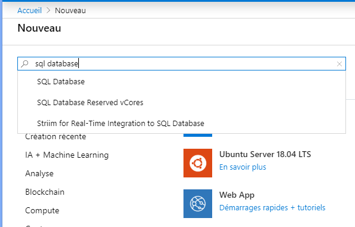

4. Dans la fenêtre qui va s'afficher, cliquez sur le bouton **Créer**

5. Sous l’onglet **Bases**, dans la section **Détails du projet**, tapez ou sélectionnez les valeurs suivantes :

   - **Abonnement**: Faites défiler la liste et sélectionnez l’abonnement approprié, s’il n’apparait pas.
   - **Groupe de ressources** : sélectionnez le groupe de ressource dans lequel vous avez déployé votre application Web.
   
     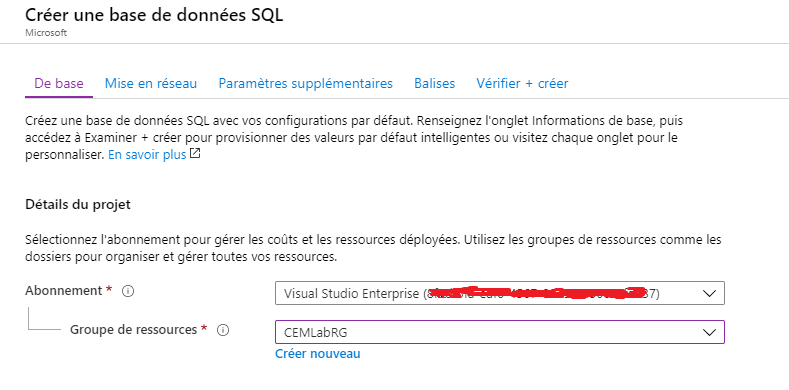

6. Dans la section formulaire **Détails de la base de données**, tapez ou sélectionnez les valeurs suivantes :

   - **Nom de la base de données** : Entrez `cemLabDatabase`.
   - **Serveur** : sélectionnez **Créer**, entrez les valeurs suivantes, puis sélectionnez **Sélectionner**.
       - **Nom du serveur** : tapez `myazuresqlserver` ainsi que des chiffres à des fins d’unicité.
       - **Connexion administrateur au serveur** : Tapez `cemuser`.
       - **Mot de passe** : tapez un mot de passe complexe qui répond aux exigences de mot de passe.
       - **Emplacement** : choisissez un emplacement dans la liste déroulante, tel que `Canada Centre`.

         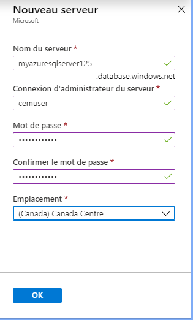

      > [!IMPORTANT]
      > Mémorisez votre nom d’utilisateur et mot de passe de connexion d’administrateur au serveur, car vous en aurez besoin pour vous connecter au serveur et aux bases de données dans le cadre de ce laboratoire.

   - **Vous souhaitez utiliser un pool élastique SQL ?**  : sélectionnez l’option **Non**.
  
   - **Calcul + Stockage** : cliquez sur **Configurer la base données**. 
      - Dans la fenêtre qui va s'afficher, cliquez sur **Vous recherchez l'édition de Base, Standard, Premiun**.
      - Cliquez ensuite sur l'onglet **De base**. Puis cliquez sur **Appliquer**.
      
      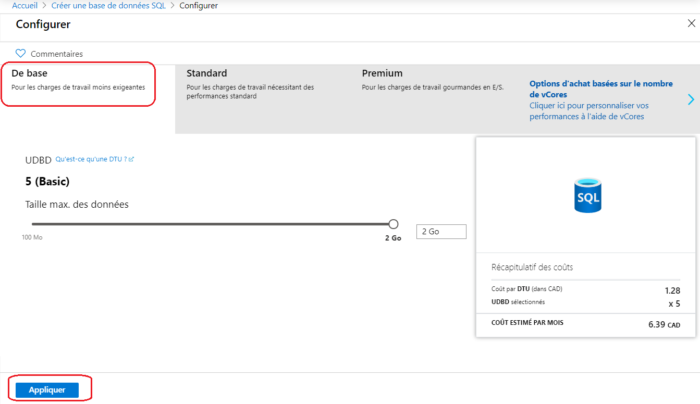

7. Laissez le reste des valeurs par défaut, puis sélectionnez **Vérifier + créer** en bas du formulaire.

11. Passez en revue les paramètres finaux et sélectionnez **Créer**.

12. Sur le formulaire **SQL Database**, sélectionnez **Créer** pour déployer le serveur et la base de données.

##  Ajouter des règles au pare-feu

Les tentatives de connexion à partir d’Internet et d’Azure doivent franchir le pare-feu avant d’atteindre votre serveur ou votre base de données SQL.

Vous devez ajouter des règles au pare-feu pour permettre aux ressources Azure (votre App Service) de se connecter à la base de données Azure et à tout client (Visual Studio, par exemple) d'accéder à partir de votre adresse IP. 

Pour mettre en place les règles de pare-feu :

1. Accédez à votre service Azure SQL Database.

2. Dans le **Vue d'ensemble**, cliquez sur **Définir le pare-feu du serveur**.

 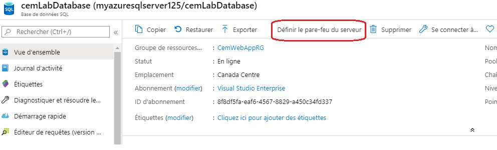

3. Cliquez sur **ACTIVÉ** dans la zone en dessous de **Autoriser les services et les ressources Azure à accéder à ce serveur**

4. Dans le champ **Nom de la règle**, donnez un nom à la règle.

5. Dans les champs **Adresse IP de début** et **Adresse IP de fin**, copiez et collez la valeur de **Adresse IP du client**.

6. Cliquez sur **Enregistrer**.

 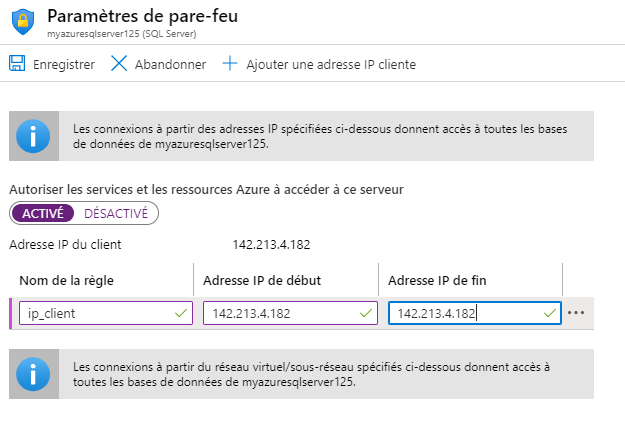

## Modifier l'application pour utiliser Azure SQL Database

### Ouvrir le projet de démarrage</a>

1. Ouvrez Visual Studio, puis sélectionnez **Ouvrir un projet ou une solution**.

 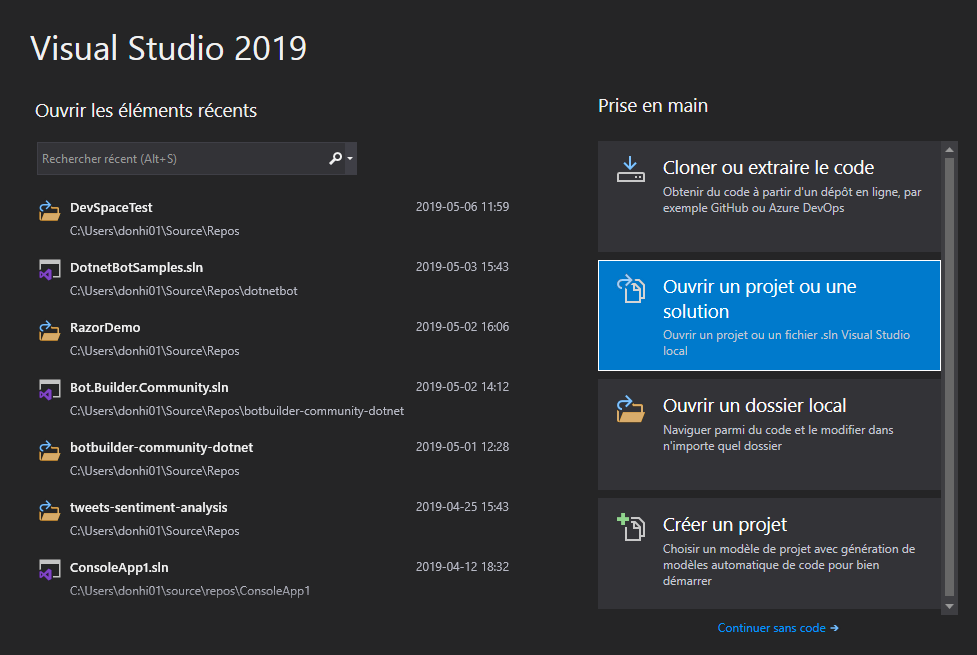

2. Ouvrez la solution de l'étape 3 (\Etape 3 - Utiliser Azure SQL Database\Workshop\Workshop.sln).

### Modifier les fichiers de Migration

Les fichiers de migrations qui ont été générés à l'étape 2 permettent de mettre à jour une base de données SQLite. Nous devons apporter quelques modifications afin de prendre en charge la mise à jour des données pour Azure SQL Database.

Editez le fichier **Migrations/xxxx_InitialMigration.cs** et remplacez le code suivant :

```cs
Id = table.Column<int>(nullable: false)
      .Annotation("Sqlite:Autoincrement", true),
```

Par 

```cs
Id = table.Column<int>(nullable: false)
      .Annotation("SqlServer:Identity", "1, 1")
      .Annotation("Sqlite:Autoincrement", true),
```

Editez également le fichier **Migrations/xxxx_InitialMigration.Desinger.cs**. Nous devons supprimer **.HasColumnType("TEXT")**. Cela permet de créer des colonnes de type **TEXT**, qui n'est pas reconnu par Azure SQL. Vous devez donc remplacer le code suivant :

```cs
modelBuilder.Entity("WebApp.Models.Commentaire", b =>
                {
                    b.Property<int>("Id")
                        .ValueGeneratedOnAdd()
                        .HasColumnType("INTEGER");

                    b.Property<DateTime>("DateCommentaire")
                        .HasColumnType("TEXT");

                    b.Property<string>("Email")
                        .IsRequired()
                        .HasColumnType("TEXT");

                    b.Property<string>("Nom")
                        .HasColumnType("TEXT");

                    b.Property<string>("Texte")
                        .IsRequired()
                        .HasColumnType("TEXT");

                    b.HasKey("Id");

                    b.ToTable("Commentaires");
                });
```
Par

```cs
modelBuilder.Entity("WebApp.Models.Commentaire", b =>
                {
                    b.Property<int>("Id")
                        .ValueGeneratedOnAdd()
                        .HasColumnType("INTEGER");

                    b.Property<DateTime>("DateCommentaire");
                      

                    b.Property<string>("Email")
                        .IsRequired();

                    b.Property<string>("Nom");

                    b.Property<string>("Texte")
                        .IsRequired();

                    b.HasKey("Id");

                    b.ToTable("Commentaires");
                });
```

### Connexion à SQL Database en production

Ouvrez le Startup.cs et recherchez le code suivant :

```cs
 services.AddDbContext<WebAppContext>(options =>
                    options.UseSqlite(Configuration.GetConnectionString("LocalConnection")));
```

Remplacez son contenu par :

```cs
   //Utiliser SQL Database dans Azure, sinon utiliser SQLite
            if (Environment.GetEnvironmentVariable("ASPNETCORE_ENVIRONMENT") == "Production")
            {
                services.AddDbContext<WebAppContext>(options =>
                   options.UseSqlServer(Configuration.GetConnectionString("AzureConnection")));

            }
            else

                services.AddDbContext<WebAppContext>(options =>
                      options.UseSqlite(Configuration.GetConnectionString("LocalConnection")));

            //Appliquer la migration pour mettre à jour la base de données
            services.BuildServiceProvider()
                .GetService<WebAppContext>().Database
                .Migrate();
```

En environnement de production, la chaine de connexion **AzureConnection** sera utilisée pour se connecter à la base de données de production (Azure SQL Database). Nous devons modifier les paramètres de l'application Web Azure pour ajouter la variable d'environnement (**ASPNETCORE_ENVIRONMENT**) Production et la chaine de connexion.

Il faut noter que Azure recherche d'abord un paramètre dans les paramètres de configuration de App Service, avant de le rechercher dans le fichier ***appsettings.json***.

### Ajout de la variable d'environnement et la chaine de connexion dans l'application Web

#### Obtenir la chaine de connexion

1. Retournez dans le portail Azure. Accédez à votre groupe de ressource, puis sélectionnez votre base de données Azure SQL.

2. Dans le menu de gauche, dans la section **Paramètres**, sélectionnez **Chaines de connexion**.

3. Copiez ensuite votre chaine de connexion dans l'onglet **ADO.NET**

 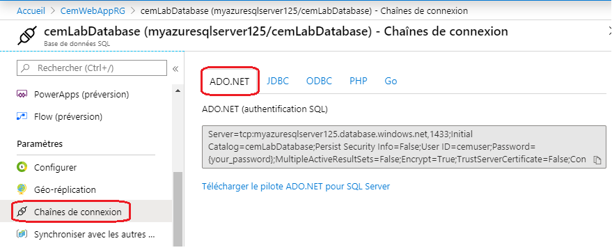

#### Ajouter les paramètres

1. Accédez maintenant à l'interface de gestion de votre application.

2. Dans le menu de gauche, dans la section **Paramètres**, sélectionnez **Configuration**.  L'onglet **Paramètres de l'application** va s'afficher par défaut.

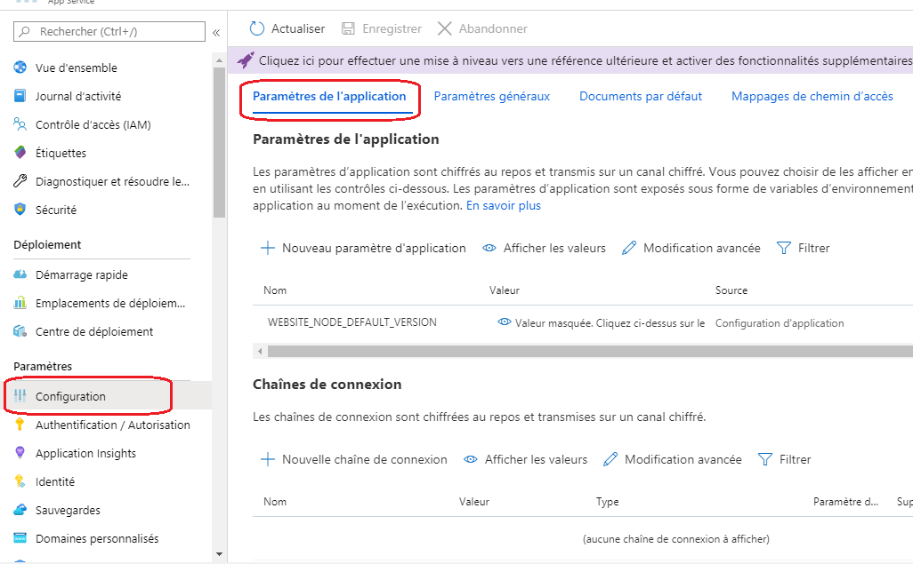

3. Cliquez sur **Nouveau paramètre d'application**

4. Dans le champ **Nom**, saisir **ASPNETCORE_ENVIRONMENT**

5. Dans le champ **Valeur**, saisir **Production** et cliquer sur **Ok**

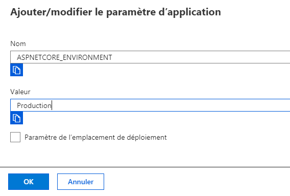

6. Cliquez sur **Nouvelle chaîne de connexion**

7. Dans le champ **Nom**, saisir **AzureConnection**

8. Dams le champ **Valeur**, coller votre chaine de connexion. Vous devez remplacer **{your_password}** par le mot de passe de l'utilisateur de votre base de données.

9. Dans le champ **Type**, déroulez et sélectionnez **SQLAzure**.

10. Cliquez sur **OK**.

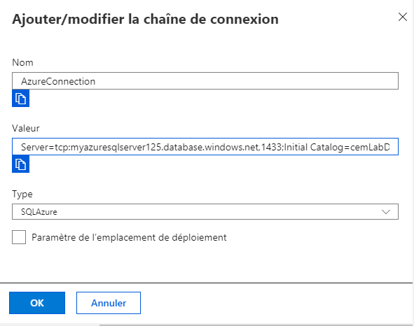

11. Cliquez enfin **Enregistrer**.

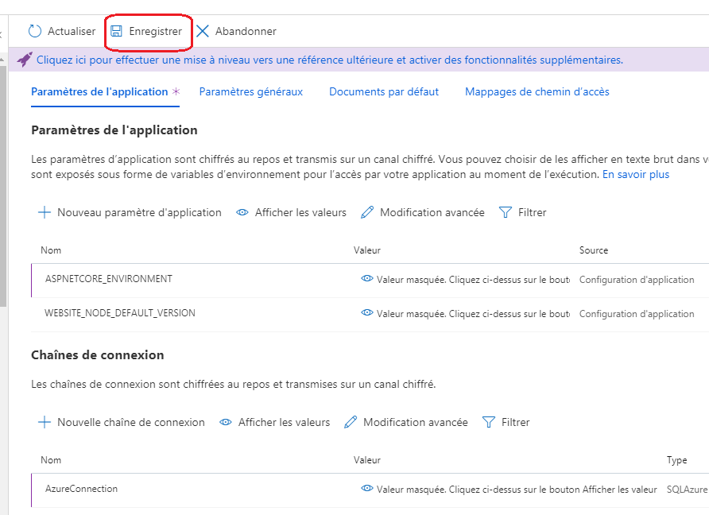

### Déployer l'application

1. Revenez dans Visual Studio et faites un clic droit sur votre projet Web. 

2. Cliquez sur **Publier**.

3. Dans la fenêtre de publication qui va s'afficher, validez que vous êtes sur le bon profil de publication, puis cliquez sur **Publier**.
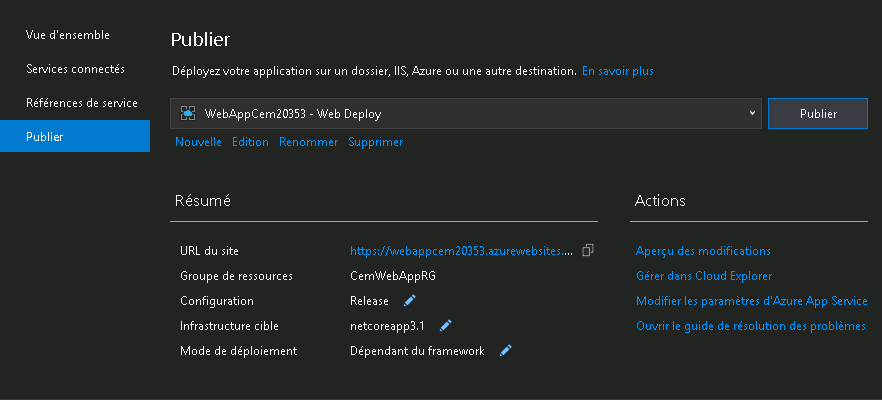

Une fois le déploiement terminé, votre application sera affichée dans une nouvelle fenêtre du navigateur.

## Editeur de requêtes

Accédez à votre instance Azure SQL Database. Dans le menu de gauche, cliquez sur **Editeur de requêtes** et entrez vos paramètres d'authentification.

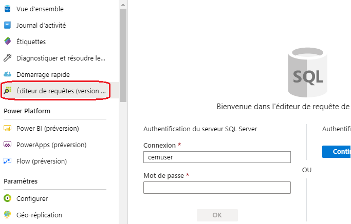

Exécutez une requête dans l'éditeur de requêtes.

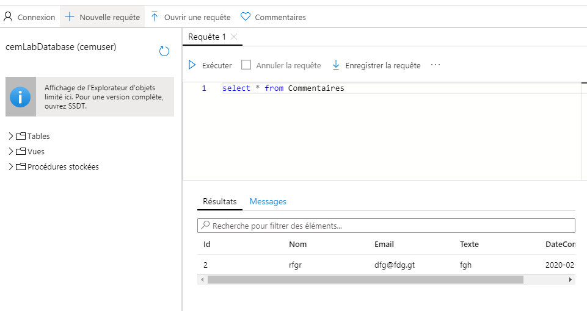

## FIN
